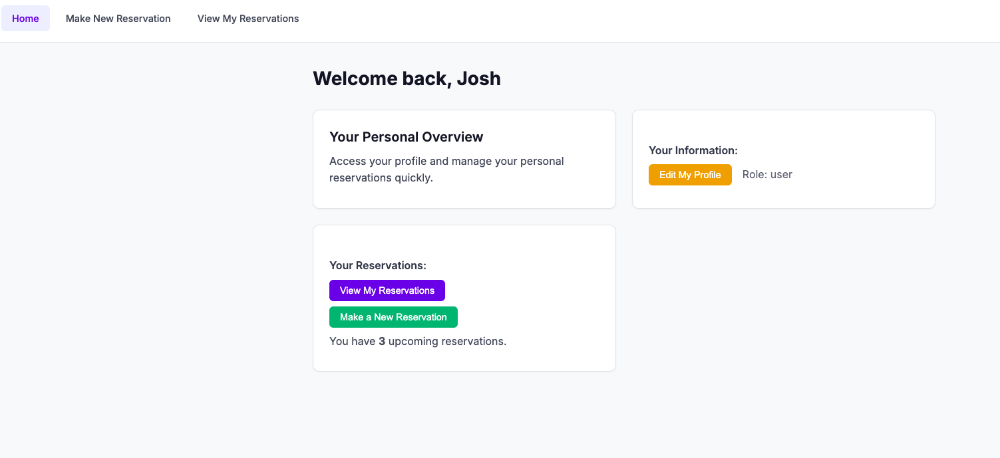
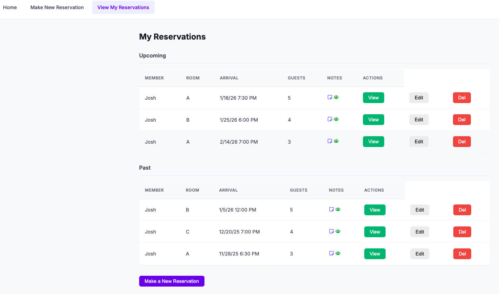

# Bookafella

A reservation system for private members clubs and exclusive dining rooms.



## The Problem

Private clubs, speakeasies, and exclusive dining rooms manage reservations through spreadsheets, phone calls, and sticky notes. Members can't self-serve. Staff waste time on back-and-forth scheduling. Guest lists get lost.

## The Solution

A simple booking system where members log in, see their reservations, and book new ones. Admins see everything. No phone tag, no double-bookings, no lost guest lists.

## How It Works

### For Members
1. Log in to your account
2. View upcoming and past reservations
3. Book a new reservation - select room, date, time, party size
4. Add guest names and notes (dietary restrictions, special occasions)
5. Edit or cancel anytime

### For Admins
1. See all reservations across all members
2. Manage the member directory
3. Full control to add, edit, or remove any booking

## Features

- **Role-Based Access** - Members see their own bookings, Admins see everything
- **Room Selection** - Book specific rooms (A, B, C, D, E)
- **Guest Lists** - Add names of everyone in your party
- **Notes Field** - Dietary restrictions, celebrations, VIP requests
- **Upcoming vs Past** - Reservations automatically sorted by date
- **Member Profiles** - Edit your own information
- **Built-in Help** - "How does this app work?" link explains everything



## Demo

Two login options to explore:

| Role | Access |
|------|--------|
| **Admin** | Full access - all reservations, all members, full CRUD |
| **Member (Josh)** | Personal access - own reservations, own profile |

*Changes save during your session but reset on page refresh.*

## Tech Stack

- React
- React Router
- Context API
- React DatePicker

## Live Demo

**[→ View Live Demo](https://josdic1.github.io/bookafella-demo/)**

## Run Locally

```bash
git clone https://github.com/josdic1/bookafella-demo.git
cd bookafella-demo/client
npm install
npm run dev
```

## Why This Matters

Exclusive venues thrive on personal service, but that doesn't mean manual chaos. Bookafella gives members the convenience of self-service booking while keeping the intimate, curated feel that makes private clubs special. No generic OpenTable vibes - just a clean tool for managing who's coming to dinner.